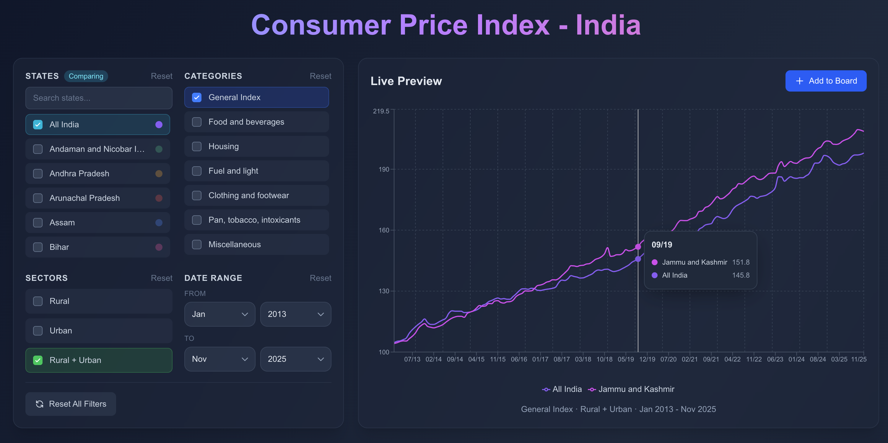
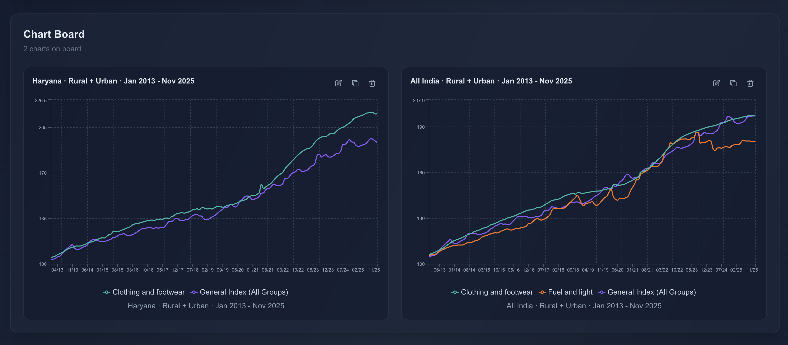

# Consumer Price Index - India

An interactive web application for visualizing and exploring Consumer Price Index (CPI) data across India. Compare inflation trends across states, categories, and sectors with intuitive charts and filters.

**Live App:** https://consumer-price-index-green.vercel.app/

## Screenshots


*Figure 1: Consumer Price Index graph comparing All India and Jammu & Kashmir between 2013 and 2025.*


*Figure 2: You can add multiple charts to the chart board for comparision or later review.*

## Motivation

This project started out of a simple frustration — I couldn't find a single place where I could easily see how consumer prices have changed over time, whether across different years, states, categories, or sectors. The information existed, but it felt scattered, hard to explore, and not very intuitive.

Along the way, I also realized that my own understanding of CPI was pretty surface-level. So this project became a way for me to learn as well — to break down what CPI actually means, why it's tracked, and why it matters in everyday life.

What began as a small personal project slowly grew into an attempt to make price data easier to explore, easier to understand, and a little less intimidating for anyone curious about inflation and cost-of-living trends.

## Tech Stack

- **Framework:** [Next.js](https://nextjs.org/) 16 with App Router
- **UI Library:** [React](https://react.dev/) 19
- **Charts:** [Recharts](https://recharts.org/)
- **Styling:** [Tailwind CSS](https://tailwindcss.com/) 4
- **Language:** [TypeScript](https://www.typescriptlang.org/) 5
- **CSV Parsing:** [PapaParse](https://www.papaparse.com/)
- **Testing:** [Jest](https://jestjs.io/)

## Getting Started

### Prerequisites

- Node.js 18+
- npm, yarn, pnpm, or bun

### Installation

1. Clone the repository:
   ```bash
   git clone https://github.com/harshit-agarwal7/consumer-price-index.git
   cd consumer-price-index
   ```

2. Install dependencies:
   ```bash
   npm install
   ```

3. Run the development server:
   ```bash
   npm run dev
   ```

4. Open [http://localhost:3000](http://localhost:3000) in your browser.

### Running Tests

```bash
npm test
```

## Data Source

CPI data is sourced from the [Ministry of Statistics and Programme Implementation (MOSPI)](https://cpi.mospi.gov.in/TimeSeries_2012.aspx), Government of India. The dataset includes monthly CPI values from January 2013 to November 2025.

## Project Structure

```
app/
├── components/
│   ├── charts/          # Chart components (ChartBoard, LivePreviewChart)
│   └── filters/         # Filter components (State, Category, Sector, DateRange)
├── hooks/               # Custom React hooks (useCPIData, useChartBoard, useMultiSelect)
├── utils/               # Helper functions (chart, date, display utilities)
├── constants/           # Colors, categories, states configuration
├── types/               # TypeScript type definitions
└── page.tsx             # Main application page

public/
└── CPIndex_Jan13-To-Nov25.csv   # CPI dataset
```

## License

This project is licensed under the MIT License.
